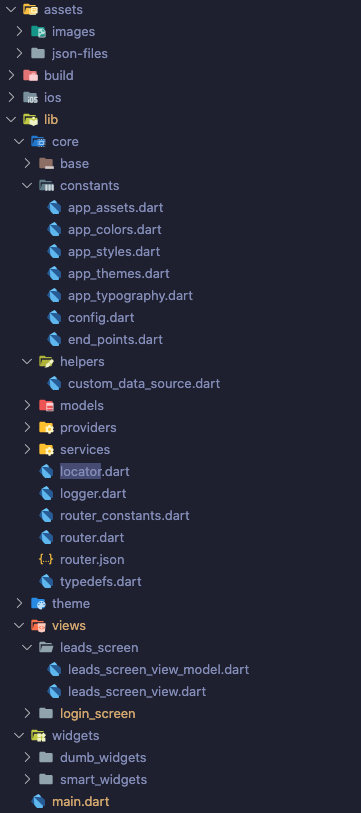
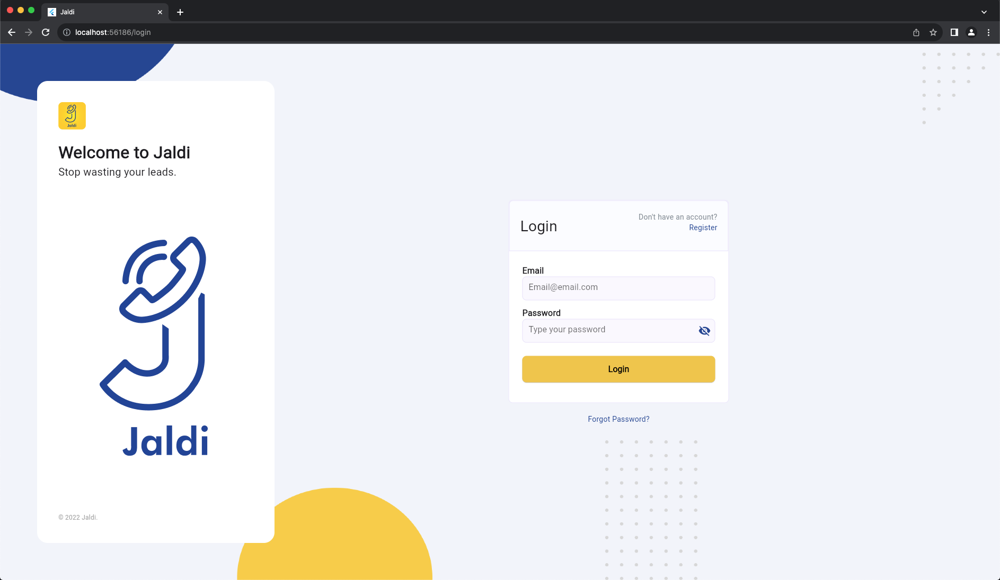
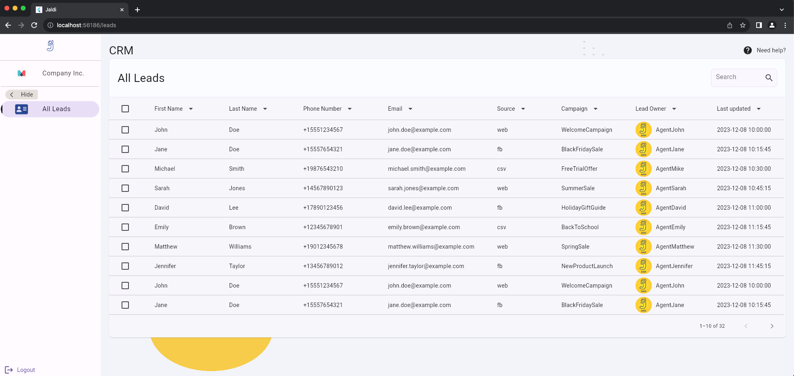
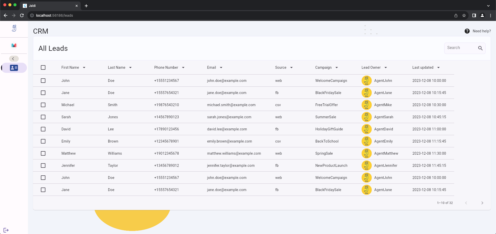

# Jaldi Project

## Overview

This project aims to provide a comprehensive solution for managing leads efficiently. It includes features for user authentication, lead management, and more.

## Project Structure

_Project Structure_

## Screenshots

_Login Screen_

_Leads Screen SideBar Open_

_Leads Screen SideBar Compact_

## Packages Used

Here are some of the important packages I used and why I used them:

- `Stacked (^3.4.1+1)`: Stacked is a MVVM (Model-View-ViewModel) architecture library for Flutter. It provides various utilities for managing and organizing code in a structured manner, separating concerns between different layers of the application.
- `Flutter Side Menu (^0.4.0)`: Flutter Side Menu provides widgets to create side menus/navigation drawers in Flutter applications. Reinventing the wheel for this didn't make sense.
- `Dio (^5.4.0)`: Dio is a powerful HTTP client for Dart and Flutter applications. It offers various features like making HTTP requests, handling interceptors, and working with REST APIs in a convenient way.
- `Provider (^6.1.1)`: Provider is a state management package that helps manage application state and update UI components efficiently. It offers a simple way to propagate changes across the widget tree and rebuild only the necessary parts of the UI.
- `VRouter (^1.2.1):`: VRouter is a declarative routing package for Flutter applications. It simplifies navigation and routing in Flutter by allowing developers to define routes, handle parameters, and manage navigation within the app.

## Project Architecture

For this project I used the MVVM Architecure. MVVM (Model-View-ViewModel) architecture is a design pattern that helps to organize code in a way that separates concerns, improves code readability, and enhances maintainability in software development. Here's a comprehensive explanation of why using MVVM architecture can be beneficial:

1. Separation of Concerns: MVVM separates your application into three main components: Model, View, and ViewModel. This separation allows for better organization and understanding of different aspects of your app's logic.

2. Scalability: MVVM makes it easier to scale the application as it grows. Each component has a clear role, allowing for easy addition of new features or modifications without affecting the rest of the codebase.

3. Testability: Due to its separation of concerns, MVVM facilitates unit testing. The ViewModel, which holds the application's business logic, can be tested independently of the View. This makes it easier to write unit tests to validate the ViewModel's behavior.

4. Reusability: With MVVM, ViewModels are not tightly coupled to Views. This decoupling enables reuse of ViewModel logic across different views or platforms. For example, the same ViewModel can be used for both a mobile app and a web app.

5. Maintainability: Because of its clear separation of concerns and the use of data binding, MVVM makes it easier to maintain and debug code. Changes to one part of the codebase are less likely to affect other parts, reducing the risk of unintended consequences.

6. Data Binding: In MVVM, the ViewModel interacts with the View through data binding mechanisms. This means that changes in the ViewModel automatically update the View, and vice versa, without explicitly writing code to update the UI.

7. Enhanced Collaboration: MVVM helps teams collaborate more effectively by offering a clear structure and common design patterns. This allows team members to understand and work on different parts of the application more easily.

8. Support for Reactive Programming: MVVM pairs well with reactive programming frameworks or libraries like Streams, Rx Dart, or RxDart. This enables the app to respond to changes in data or UI states reactively, leading to more responsive and dynamic applications.

In summary, MVVM architecture provides a robust structure that promotes clean, modular, and maintainable code. Its clear separation of concerns and support for testing make it an excellent choice for building scalable and maintainable applications.

## Installation

1. Clone the repository: `git clone https://github.com/your-username/your-repo.git`
2. Change directory to project folder: `cd your-project-folder`
3. Install dependencies: `flutter pub get`

## Usage

1. Run the application: `flutter run`
2. Use the app following the on-screen instructions.

## Contributing

1. Fork the repository.
2. Create a new branch: `git checkout -b feature`
3. Make your changes and commit: `git commit -am 'Add new feature'`
4. Push to the branch: `git push origin feature`
5. Submit a pull request.

## Credits

Author: Khadija Khan
